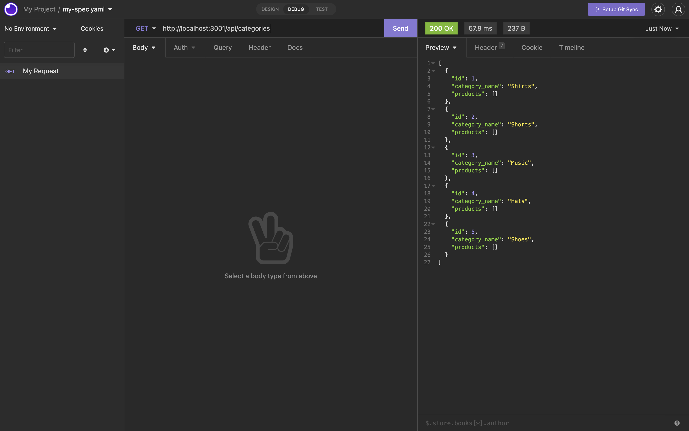

# E-commerce-Back-End

## Description 

The E-commerce-Back-End application provides the user with ablity to view the current inventory & price of a product, and allows the user to update the information as needed.
Using the sequelize ORM the application is then able to connect with the MySql database. The user has the abilty to change and access data from the database with api routes using the GET,POST,PUT, & DELETE methods.

## Table of Contents 

* [Installation](#installation)
* [Usage](#usage)
* [Credits](#credits)
* [License](#license)

## Installation

- Node.js is needed to run application
- Install npm using command lines (npm install)
- Install MySql2 (npm install MySql2)
- Install express sequelize (npm install express sequelize)
- Install dotenv to gain access to MySql (npm install dotenv)
- Run seed files to populate table data (npm run seed)

## Usage 

To watch app demo please click here 
[https://www.loom.com/share/a605bc48a6b744918081be8330bdafca?sharedAppSource=personal_library]
[https://www.loom.com/share/aa5a5a58a6314efbad4edc85b160f9e9?sharedAppSource=personal_library]
[https://www.loom.com/share/1c6bcb04e96a4ddf8c88a01396358603?sharedAppSource=personal_library]

## License

- No License

## Contribution

Reggie Tenkorang

## Tests

No test were performed. 
